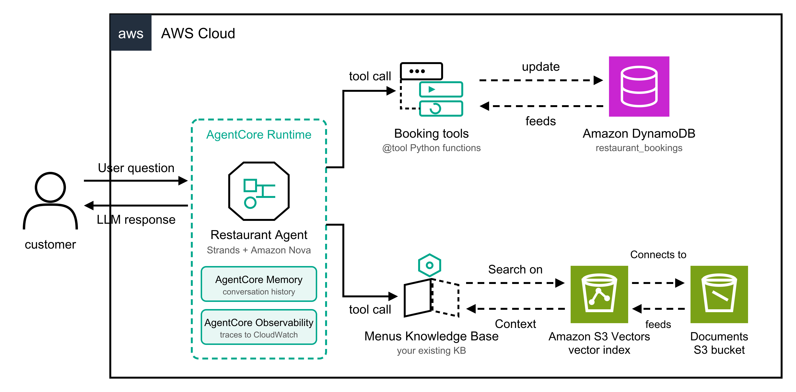
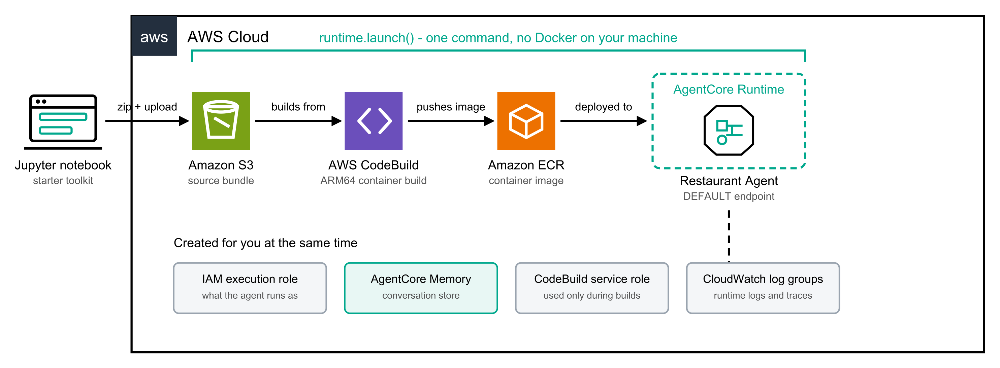
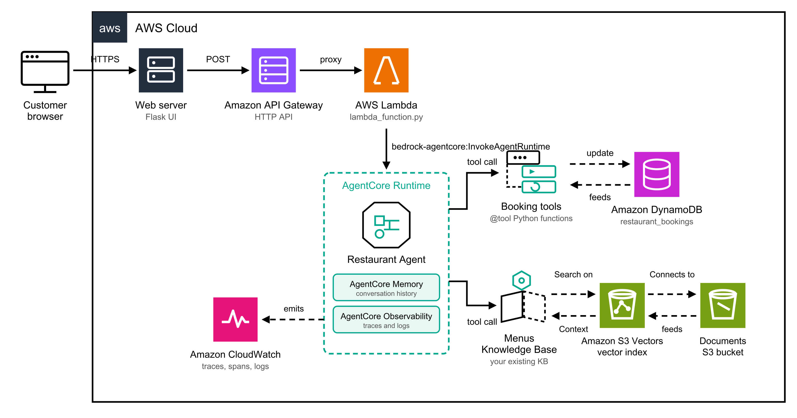

# Restaurant Booking Agent on Amazon Bedrock AgentCore

A restaurant assistant built on **Amazon Bedrock AgentCore** — it answers menu questions
from a Bedrock Knowledge Base and creates, reads and deletes table bookings in DynamoDB.

Two parts:

1. **Build and deploy the agent** — the Jupyter notebook.
2. **Call it from an application** — Flask UI → API Gateway → Lambda → AgentCore Runtime.

## Architecture

Three views, because mixing them into one picture makes all three unreadable.

### 1. The agent

What the agent is made of.



### 2. Build and deploy

What `runtime.launch()` does, once, when you deploy. Source zip → **S3** → **CodeBuild**
(ARM64) → **ECR** → **AgentCore Runtime**. CodeBuild is invoked directly; there is no
CodePipeline. This is also why you never need Docker on your own machine.



### 3. End to end

The full request path, once an application is in front of the agent.
Browser → Flask web server → API Gateway → Lambda → AgentCore Runtime → tools.



## Files

| File | What it is |
| --- | --- |
| `CODE_WALKTHROUGH.md` | **Line-by-line explanation of every file, written to be read aloud when teaching.** |
| `01_agentcore_restaurant_agent.ipynb` | Build and deploy the agent. Run it top to bottom. |
| `restaurant_agent.py` | The agent — tools, memory, entrypoint. Deployed into the runtime. |
| `requirements.txt` | Dependencies installed **inside** the deployed container. |
| `notebook-requirements.txt` | Dependencies for running the notebook. |
| `lambda_function.py` | Lambda handler that invokes the deployed agent. Copy-paste into your function. |
| `ui/app.py` | Flask app. Serves the chat page and proxies to API Gateway. |
| `ui/templates/index.html` | The chat UI. |
| `ui/requirements.txt` | Dependencies for the Flask app. |
| `images/` | The three architecture diagrams (PNG + SVG source for each). |

---

## Part 1 — Deploy the agent

1. Set `KNOWLEDGE_BASE_ID` in the notebook's configuration cell to your own Bedrock
   Knowledge Base. Nothing else needs editing.
2. Enable your chosen model in the Bedrock console (defaults to `us.amazon.nova-2-lite-v1:0`).
3. Run every cell. No Docker required — `runtime.launch()` builds the ARM64 image in AWS
   CodeBuild.

The notebook creates the DynamoDB table, the IAM policy, the AgentCore Memory store and
the runtime for you. There is no manual IAM work.

At the end it prints the **Agent Runtime ARN**. Keep it — the Lambda needs it.

### If `obs.list()` says "No spans found"

CloudWatch Transaction Search indexes only **1% of spans by default**, so a handful of
test invocations index nothing. Step 4 of the notebook sets it to 100%. Spans also take
5–10 minutes to become queryable after Transaction Search is first enabled.

---

## Part 2 — Lambda

Copy the contents of `lambda_function.py` into your existing Lambda function.

**Environment variables**

| Name | Value |
| --- | --- |
| `AGENT_RUNTIME_ARN` | the Agent Runtime ARN printed at the end of the notebook |
| `AGENT_QUALIFIER` | optional, defaults to `DEFAULT` |

**Timeout** — set it to at least **60 seconds**. The agent may make several model and tool
calls per turn.

**IAM** — add this to the Lambda execution role:

```json
{
  "Version": "2012-10-17",
  "Statement": [
    {
      "Effect": "Allow",
      "Action": "bedrock-agentcore:InvokeAgentRuntime",
      "Resource": [
        "arn:aws:bedrock-agentcore:REGION:ACCOUNT_ID:runtime/AGENT_ID",
        "arn:aws:bedrock-agentcore:REGION:ACCOUNT_ID:runtime/AGENT_ID/runtime-endpoint/*"
      ]
    }
  ]
}
```

Replace `REGION`, `ACCOUNT_ID` and `AGENT_ID` — they are all inside the Agent Runtime ARN.

**Test it** in the Lambda console with this test event:

```json
{ "body": "{\"prompt\": \"What is in the children's menu?\"}" }
```

You should get back `{"result": "...", "session_id": "..."}`.

### Request and response

The Lambda accepts a JSON body:

| Field | Required | Purpose |
| --- | --- | --- |
| `prompt` | yes | what the customer said |
| `session_id` | no | reuse it to continue a conversation; generated if absent |
| `customer_name` | no | name to use for the reservation |
| `today` | no | the date the agent treats as today |
| `actor_id` | no | who is talking — memory is scoped per actor |

and returns `{ "result": "...", "session_id": "..." }`.

All four capabilities go through this one endpoint. The agent decides which tool to call
based on what the customer says:

| Ask it | Tool it calls |
| --- | --- |
| "What's on the children's menu?" | `search_menu` |
| "Book a table for 4 at 21:00 on 2026-05-05" | `create_booking` |
| "Show me my bookings" | `list_bookings` |
| "What are the details of booking a1b2c3d4?" | `get_booking_details` |
| "Cancel that booking" | `delete_booking` |

`list_bookings` scans the table filtered by customer name, so the agent can answer
"show me my bookings" without the customer knowing a booking id. It needs
`dynamodb:Scan`, which Step 7 of the notebook grants. A scan is fine at this size; for a
large table, add a global secondary index on `name` and query it instead.

---

## Part 3 — Flask UI

```bash
cd ui
pip install -r requirements.txt

# Windows
set API_GATEWAY_URL=https://xxxxx.execute-api.us-east-1.amazonaws.com/chat
# macOS / Linux
export API_GATEWAY_URL=https://xxxxx.execute-api.us-east-1.amazonaws.com/chat

python app.py
```

Open <http://127.0.0.1:5000>.

The browser posts to Flask, and **Flask** calls API Gateway server-side. That means you do
not need CORS on your HTTP API, and the endpoint URL never reaches the browser.

The page keeps one `session_id` per conversation, so the agent follows up correctly across
turns. **New conversation** issues a fresh one. The optional name field is passed as
`customer_name`, so the agent books under that name without being told.

---

## Cleaning up

The last cells of the notebook run `runtime.destroy()` and delete the DynamoDB table.
Your Knowledge Base is never touched.
